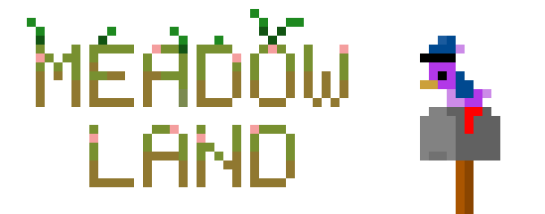



Modding hub for the Desktop Meadow, delivered to you by the SamHub/ResourceHub project. \n
Go to the [Special Thanks Page](thanks.md) to see a list of everyone who has contributed to the meadow

## [View Fonts, Resource Packs, And Sprite Packs Here](../rp/index/INDEX.md)

## Packs have been migrated
If you notice any issues such as broken links please join the discord server below and let us know, it will be much appreciated 

## [Join The Discord Support Server Here](discord.gg/xZFRmPT)

## What can I add to Meadow Land?
At the current point in time you can create custom spritesheets (to the same scale at the moment), custom fonts as well as custom letter backgrounds, all of these are accepted (within reason)

No decompiling and making actual mods for now please!

## FAQs

Want to know how to make a Resource Pack of your own? Find out how to do that and more on [our FAQ page](FAQ.md)!
